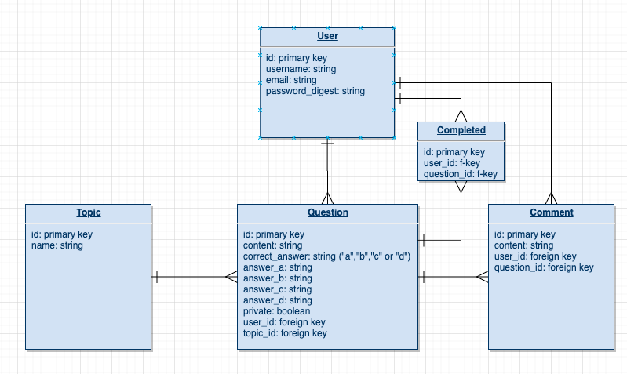

# Quizmon

## Summary 

Quizmon is an application aimed at users sharing multiple choice questions with the intent on helping each other study and improve at programming and data structures. A user can browse the existing questions, or sign up for an account and start writing questions. They can also edit or delete their own questions.

Users must sign in in order to write comments on questions, but can read anyone's comments.

Currently there are only 3 topics:
  * Javascript 
  * Ruby 
  * Data structures 
  
New topics can currently be added by running a Ruby script in the deployed server, but there is no browser interface for adding topics yet.

## Tech Stack 

Quizmon is a full stack RESTful application that uses React on the frontend and Ruby on Rails on the backend. The Ruby on Rails server uses Postgresql to manage the database, and a basic authentication system has been implemented using bcrypt and JSON web tokens in the Ruby controllers. The React app uses axios to make API calls to the routes of the backend. 

## Wireframes and planning diagrams 

Here are the wireframes made in Adobe XD before I started coding the project. I have drifted away from the original style based on my preferences and choices as I worked on the CSS. 

[Adobe XD wireframes](./quizmon-mockups.xd)

Here is the React component hierarchy, which does not include many nested components used for display.

[React Component Hierarchy - draw.io](https://app.diagrams.net/#G1ZBsu3NufmAujOtJNN5jmgIDCL-xgoabz)

Here is an ERD of the databases on the backend. Currently, the Completed table has not been implemented but Users, Questions, Topics and Comments have been implemented. 

